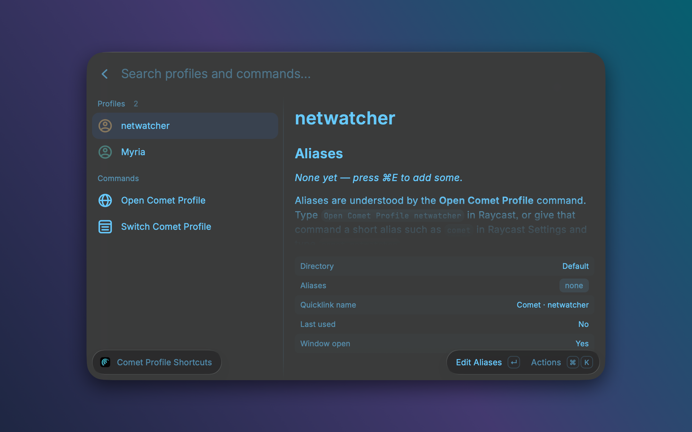

# Comet Profile Switcher

A [Raycast](https://raycast.com) extension that opens a specific [Comet](https://www.perplexity.ai/comet) browser profile instantly. Type `work` and hit Enter, or press a global hotkey, and Comet opens (or focuses) that profile.


It reads the profiles Comet already has, so there's nothing to set up. Launching goes through Comet's own `--profile-directory` flag, exactly like picking a profile from Comet's menu, and hands off to the running instance if Comet is already open.

## Commands

| Command | What it does |
| --- | --- |
| **Switch Comet Profile** | Lists your profiles with their Comet colors, a dot for profiles that have a window open, and a "Last used" tag. Enter opens the profile (focusing its window if one exists). ⌘Enter opens a new window. |
| **Open Comet Profile** | Opens a profile by alias, name or directory: `Open Comet Profile work`. Optional second argument is a URL to open in that profile. Run it with no profile to get the picker. |
| **Comet Profile Shortcuts** | The settings view. Shows every profile with its aliases, Quicklink name and deeplink, plus how to attach a hotkey or alias. ⌘E edits aliases, ⌘L creates the Quicklink. |



## Aliases and hotkeys

There are two layers, and the Shortcuts view shows both.

**1. Aliases inside the extension.** In *Comet Profile Shortcuts*, select a profile and press ⌘E to give it aliases like `work, w`. The *Open Comet Profile* command understands them, so `Open Comet Profile w` opens that profile. Give that command a short alias of its own in Raycast Settings (say `comet`) and you get `comet w`, `comet personal`, and so on with a single command.

**2. A dedicated alias or hotkey per profile.** Raycast only attaches aliases and hotkeys to commands and Quicklinks, never to items inside a list. So each profile gets its own Quicklink:

1. In *Switch Comet Profile* or *Comet Profile Shortcuts*, select the profile and press **⌘L**, then save the Quicklink. It is named `Comet · <profile>`.
2. Open Raycast Settings → **Extensions** and search for that name.
3. Set its **Alias** (e.g. `work`) and/or **Hotkey** (e.g. Hyper + W).

Typing `work` in Raycast, or pressing the hotkey, now opens that profile straight away. Raycast doesn't let extensions read back which aliases and hotkeys you assigned, so that part always lives in Raycast Settings; the Shortcuts view tells you exactly where to look.

The Quicklink is a deeplink, e.g.

```
raycast://extensions/<you>/comet-profile-switcher/open-profile?arguments=%7B%22profile%22%3A%22Profile%202%22%7D
```

You can use the same link from Shortcuts.app, Keyboard Maestro, BetterTouchTool or a terminal (`open '…'`). When a deeplink is triggered from outside Raycast, Raycast asks for confirmation the first time; choose *Always Run Command*.

## Preferences

- **Comet Application**: only needed if Comet isn't in `/Applications`.
- **Comet Data Directory**: defaults to `~/Library/Application Support/Comet`.
- **Always open a new window**: by default an existing window for the profile is focused; enable this to get a fresh window every time.

## Performance

- No network, no background processes, no menu bar item.
- Comet's profile registry (`Local State`, about 1 MB) is parsed once and cached; it's re-read only when the file changes.
- Comet is launched through macOS `open`, so nothing stays attached to Raycast.

## How it works

Comet is Chromium-based. Its profiles live in `~/Library/Application Support/Comet/<directory>` and are listed in `Local State` under `profile.info_cache`, with the display name and theme colors. The extension launches:

```
open -na /Applications/Comet.app --args --profile-directory="Profile 2" [--new-window] [url]
```

## Development

```sh
npm install
npm run dev      # installs the extension into Raycast and hot-reloads
npm run lint
npm run build
```

Before publishing to the Raycast Store, set `author` in `package.json` to your Raycast username.

## License

MIT
